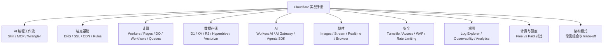

# Cloudflare 实战手册

AI 编程时代的 Cloudflare 实战手册——用 AI 写代码，用 Cloudflare 部署到全球。

在线阅读：[chendahuang.com/playbook/cloudflare](https://chendahuang.com/playbook/cloudflare/)

## 全景图

## 目录

- [1. AI 编程工作流](#1-ai-编程工作流)
- [2. Cloudflare 功能模块](#2-cloudflare-功能模块)
- [3. 计费与额度](#3-计费与额度)
- [4. 开源项目](#4-开源项目)
- [5. 避坑指南](#5-避坑指南)
- [6. 国内访问](#6-国内访问)
- [7. Cloudflare Agents](#7-cloudflare-agents)
- [8. 域名](#8-域名)
- [9. 邮件](#9-邮件)
- [官方资源](#官方资源)

<main class="playbook-home">
  <section class="playbook-hero">
    

      <h1>Cloudflare 实战手册</h1>
      
从开发、部署到排障，按真实任务找到下一步。

    

    

      <a class="playbook-action primary" href="./chapters/01-ai-workflow">开始阅读<svg class="chapter-arrow" aria-hidden="true" viewBox="0 0 24 24" fill="none"><path d="M5 12h14M13 6l6 6-6 6" stroke="currentColor" stroke-width="1.8" stroke-linecap="round" stroke-linejoin="round"/></svg></a>
      <a class="playbook-action" href="#chapters">查看全部章节<svg class="chapter-arrow" aria-hidden="true" viewBox="0 0 24 24" fill="none"><path d="M5 12h14M13 6l6 6-6 6" stroke="currentColor" stroke-width="1.8" stroke-linecap="round" stroke-linejoin="round"/></svg></a>
    

  </section>

  <section class="playbook-section" id="chapters">
    

      <h2>按任务开始</h2>
      
选择当前最需要解决的问题，直接进入对应章节。

    

    

  <a class="chapter-link" href="./chapters/01-ai-workflow">
    01
    <strong class="chapter-title">## 1. AI 编程工作流</strong>接入 Skills、MCP、Wrangler 和运行日志，建立 AI 编程工作流。
    <svg class="chapter-arrow" aria-hidden="true" viewBox="0 0 24 24" fill="none"><path d="M5 12h14M13 6l6 6-6 6" stroke="currentColor" stroke-width="1.8" stroke-linecap="round" stroke-linejoin="round"/></svg>
  </a>
  <a class="chapter-link" href="./chapters/02-platform-map">
    02
    <strong class="chapter-title">## 2. Cloudflare 功能模块</strong>按真实场景理解 Cloudflare 的计算、存储、AI、媒体与安全能力。
    <svg class="chapter-arrow" aria-hidden="true" viewBox="0 0 24 24" fill="none"><path d="M5 12h14M13 6l6 6-6 6" stroke="currentColor" stroke-width="1.8" stroke-linecap="round" stroke-linejoin="round"/></svg>
  </a>
  <a class="chapter-link" href="./chapters/03-pricing">
    03
    <strong class="chapter-title">## 3. 计费与额度</strong>看懂 Free、Paid、额度边界和真实成本。
    <svg class="chapter-arrow" aria-hidden="true" viewBox="0 0 24 24" fill="none"><path d="M5 12h14M13 6l6 6-6 6" stroke="currentColor" stroke-width="1.8" stroke-linecap="round" stroke-linejoin="round"/></svg>
  </a>
  <a class="chapter-link" href="./chapters/04-open-source">
    04
    <strong class="chapter-title">## 4. 开源项目</strong>按用途挑选值得参考的官方与社区项目。
    <svg class="chapter-arrow" aria-hidden="true" viewBox="0 0 24 24" fill="none"><path d="M5 12h14M13 6l6 6-6 6" stroke="currentColor" stroke-width="1.8" stroke-linecap="round" stroke-linejoin="round"/></svg>
  </a>
  <a class="chapter-link" href="./chapters/05-production-pitfalls">
    05
    <strong class="chapter-title">## 5. 避坑指南</strong>把运行时、数据、安全和配置中的常见问题提前处理。
    <svg class="chapter-arrow" aria-hidden="true" viewBox="0 0 24 24" fill="none"><path d="M5 12h14M13 6l6 6-6 6" stroke="currentColor" stroke-width="1.8" stroke-linecap="round" stroke-linejoin="round"/></svg>
  </a>
  <a class="chapter-link" href="./chapters/06-china-access">
    06
    <strong class="chapter-title">## 6. 国内访问</strong>理解中国大陆访问、域名、缓存、线路与合规边界。
    <svg class="chapter-arrow" aria-hidden="true" viewBox="0 0 24 24" fill="none"><path d="M5 12h14M13 6l6 6-6 6" stroke="currentColor" stroke-width="1.8" stroke-linecap="round" stroke-linejoin="round"/></svg>
  </a>
  <a class="chapter-link" href="./chapters/07-agents">
    07
    <strong class="chapter-title">## 7. Cloudflare Agents</strong>把 Agent 部署成长期在线、有状态、能调度的服务。
    <svg class="chapter-arrow" aria-hidden="true" viewBox="0 0 24 24" fill="none"><path d="M5 12h14M13 6l6 6-6 6" stroke="currentColor" stroke-width="1.8" stroke-linecap="round" stroke-linejoin="round"/></svg>
  </a>
  <a class="chapter-link" href="./chapters/08-domains">
    08
    <strong class="chapter-title">## 8. 域名</strong>完成域名购买、托管、转移与 Cloudflare DNS 配置。
    <svg class="chapter-arrow" aria-hidden="true" viewBox="0 0 24 24" fill="none"><path d="M5 12h14M13 6l6 6-6 6" stroke="currentColor" stroke-width="1.8" stroke-linecap="round" stroke-linejoin="round"/></svg>
  </a>
  <a class="chapter-link" href="./chapters/09-email">
    09
    <strong class="chapter-title">## 9. 邮件</strong>用 Cloudflare 组合发送、接收、路由和邮件自动化。
    <svg class="chapter-arrow" aria-hidden="true" viewBox="0 0 24 24" fill="none"><path d="M5 12h14M13 6l6 6-6 6" stroke="currentColor" stroke-width="1.8" stroke-linecap="round" stroke-linejoin="round"/></svg>
  </a>
  <a class="chapter-link" href="./chapters/10-resources">
    10
    <strong class="chapter-title">## 官方资源</strong>集中查找官方文档、模板、限制与支持入口。
    <svg class="chapter-arrow" aria-hidden="true" viewBox="0 0 24 24" fill="none"><path d="M5 12h14M13 6l6 6-6 6" stroke="currentColor" stroke-width="1.8" stroke-linecap="round" stroke-linejoin="round"/></svg>
  </a>
    

  </section>

  <section class="playbook-section">
    

      <h2>全部 Playbook</h2>
      
同一套阅读系统，各自保留一个清晰主题。

    

    <nav class="playbook-family" aria-label="全部 Playbook">
      <a class="playbook-family-link" href="https://chendahuang.com/playbook/cloudflare/"><strong>Cloudflare</strong>开发、部署与生产运维</a>
      <a class="playbook-family-link" href="https://chendahuang.com/playbook/codex/"><strong>Codex</strong>长期协作与可靠交付</a>
      <a class="playbook-family-link" href="https://chendahuang.com/playbook/feishu/"><strong>飞书</strong>协作、AI 与 Agent 工作流</a>
      <a class="playbook-family-link" href="https://chendahuang.com/playbook/macos/"><strong>macOS</strong>软件、效率与系统维护</a>
    </nav>
  </section>
</main>
