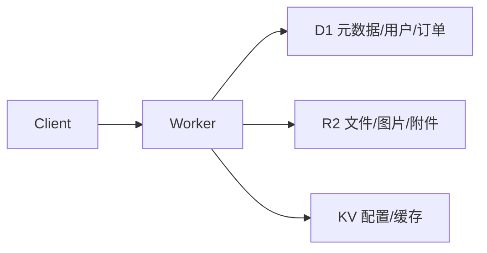
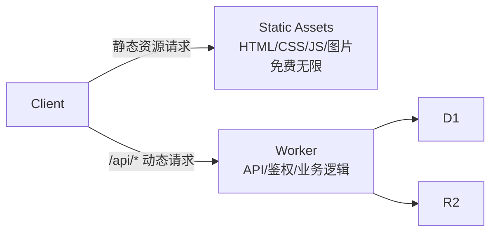
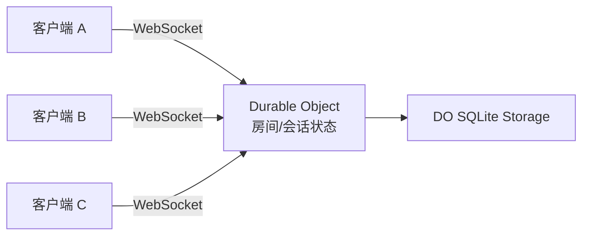
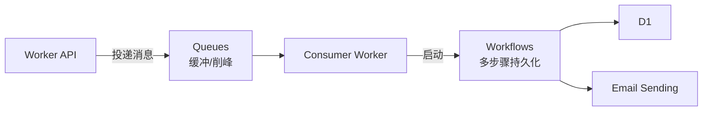
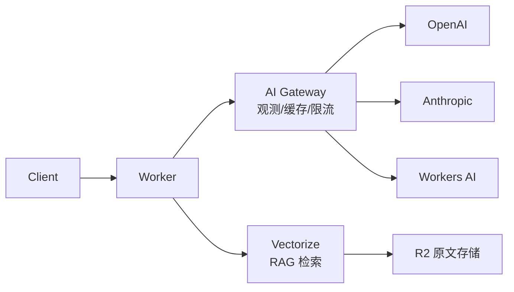

<script setup>
import { withBase } from 'vitepress'
import { Cloud, Bot, Wallet, Zap, Package, AlertTriangle, Globe, Search, ClipboardList, Link, Compass, Cpu, Database, Shield, Brain, Lock, Server, ListFilter, Code, FileText, Boxes, GitBranch, ArrowLeftRight, Container, Clock, Table, Key, HardDrive, Layers, Scan, UserCheck, LockKeyhole, ShieldAlert, Gauge, Umbrella, Braces, BrainCircuit, Network, Image, Video, Radio, MonitorPlay, ShoppingCart, Mail } from '@lucide/vue'
</script>

# 1. AI 编程工作流 {#ai-编程工作流}

先给编程代理接上 Cloudflare 的官方 Skills、MCP 和运行日志。Skills 提供开发约束，MCP 查询文档和账号状态，日志负责证明线上到底发生了什么。这本手册用来补产品地图和工程取舍，不用从头读到尾。

如果想让它快速了解全貌，把 llm.txt 喂给它（见下方"把这本手册喂给 AI"）。

## 安装 Skill 和 MCP

Cloudflare 官方维护了一套 Agent Skills（[cloudflare/skills](https://github.com/cloudflare/skills)），支持 Claude Code、Cursor、OpenCode、OpenAI Codex、Pi 等主流 agent。安装后，Agent 会按任务加载 Workers 运行时、绑定、部署和安全约束，减少照搬普通 Node.js 写法的错误。

**Claude Code：**

```text
/plugin marketplace add cloudflare/skills
/plugin install cloudflare@cloudflare
```

**Cursor：**

从 Cursor Marketplace 安装，或通过 Settings > Rules > Add Rule > Remote Rule (Github) 添加 `cloudflare/skills`。

**通用方案（OpenCode、OpenAI Codex、Pi 等）：**

```bash
npx skills add https://github.com/cloudflare/skills
```

**手动安装：**

Clone [cloudflare/skills](https://github.com/cloudflare/skills) 仓库，把 skill 文件夹复制到对应 agent 的目录：

| Agent | Skill 目录 |
| --- | --- |
| Claude Code | `~/.claude/skills/` |
| Cursor | `~/.cursor/skills/` |
| OpenCode | `~/.config/opencode/skills/` |
| OpenAI Codex | `~/.codex/skills/` |
| Pi | `~/.pi/agent/skills/` |

## 装完之后 AI 多了什么

**Skills（说明书）** — 上下文匹配时自动加载：

| Skill | 覆盖范围 |
| --- | --- |
| cloudflare | 平台全景：Workers/Pages/存储/AI/网络/安全/IaC |
| agents-sdk | 有状态 AI agent、调度、RPC、MCP server、流式聊天 |
| durable-objects | 状态协调、WebSocket、SQLite、alarms |
| sandbox-sdk | 安全代码执行、code interpreter |
| wrangler | 部署和管理 Workers/KV/R2/D1/Queues/Workflows |
| building-mcp-server-on-cloudflare | 远程 MCP server 构建 |
| building-ai-agent-on-cloudflare | AI agent 构建 |

**MCP Servers（连接器）** — 插件安装后自动注册：

| MCP Server | 用途 |
| --- | --- |
| cloudflare-docs | 查询官方文档（日常必开） |
| cloudflare-api | 管理账号资源、zone、设置（要上线、改配置时开） |
| cloudflare-bindings | 构建 Workers 应用 |
| cloudflare-builds | 查看 Workers 构建记录 |
| cloudflare-observability | 查看日志和分析（排查问题时开） |

**Commands（命令）：**

- `/cloudflare:build-agent` — 用 Agents SDK 构建 AI agent
- `/cloudflare:build-mcp` — 构建 MCP server

**Wrangler（命令行工具）** — Skill 和 MCP 提供上下文，开发和部署仍由 Wrangler 执行：

```bash
npm i -D wrangler@latest
npx wrangler dev      # 本地开发
npx wrangler deploy   # 部署上线
npx wrangler tail     # 实时日志
```

## 把这本手册喂给 AI

如果你想让 AI 快速了解 Cloudflare 全貌，把下面这行发给它：

```text
阅读 https://chendahuang.com/playbook/cloudflare/llm.txt 了解 Cloudflare 平台全貌，然后帮我……
```

这个文件是本手册的纯文本索引，涵盖功能模块、架构模式、计费和避坑指南，适合和官方 Skill、MCP 一起提供给 Agent。

## 新项目从零开始

如果连项目都还没建：

```bash
npm create cloudflare@latest -- my-worker
```

跟着提示选，建完进去装 Wrangler、装 Skill，开始让 AI 写。

## 线上出问题时喂给 AI 什么

AI 能自己开 Observability MCP 看日志、开 Browser MCP 看 Dashboard，但它不知道你这边看到的现象。让它排查线上问题前，把这些贴给它：

- 出问题的完整 URL。
- 发生时间和时区。
- HTTP 状态码（`522`、`1101` 这种）。
- 响应头里的 `cf-ray` 或 Ray ID——Cloudflare 定位这次请求的唯一线索。
- 是否只在某个地区、运营商、浏览器、登录态出现。
- 最近一次部署 commit 和 Cloudflare deployment/version。
- 是否命中缓存、WAF、Rate Limiting、Access 或 Worker。

本地快速拿响应头：

```bash
curl -I https://example.com/path
```

错误码不知道属于哪一层时，看第 5 节开头的错误码索引表。

## 常见架构模式

以下是 Cloudflare 上最常见的几种架构组合，每种附适用场景和取舍说明。

**模式一：Worker + D1 + R2（全栈应用）**



适用场景：SaaS 原型、内容管理、API 服务。D1 存结构化数据和业务关系，R2 存文件本体，KV 缓存高频读取的配置。这是 AI 编程生成全栈项目时最自然的组合。

取舍：D1 不是 Postgres，复杂事务和高并发写入场景需要考虑 Hyperdrive 连外部数据库。

**模式二：Workers Static Assets + Worker（前后端一体）**



适用场景：React/Vue/Svelte 前端 + API 后端。静态资源请求免费且不计入 Workers 配额，只有动态请求消耗 Worker 额度。

取舍：前后端强绑定在同一个 Worker 项目中，适合小团队和快速迭代；大型团队可能需要拆分独立服务。

**模式三：Worker + Durable Objects + WebSocket（实时协作）**



适用场景：聊天室、协作编辑、在线游戏、实时看板。Durable Objects 提供单实例强一致性和 WebSocket 支持，Hibernation 模式可以大幅降低长连接成本。

取舍：单个 DO 约 500-1000 req/s 上限，高并发需要按实体分片。不适合做通用数据库。

**模式四：Worker + Queues + Workflows（异步处理）**



适用场景：订单处理、数据管道、AI 审核流、用户生命周期邮件。Queues 做入口缓冲和削峰，Workflows 处理多步骤流程，某一步失败只重试该步。

取舍：架构复杂度较高，简单的同步 API 不需要引入这套机制。

**模式五：Worker + AI Gateway + 外部模型（AI 应用）**



适用场景：AI 聊天、RAG 问答、多模型路由。AI Gateway 统一管理多个模型 provider 的调用、缓存和成本，Vectorize 做语义检索，R2 存原始文档。

取舍：Workers AI 的模型能力有限，复杂推理和多模态场景仍需外部模型。

## AI 编程 Cloudflare 常见翻车点

AI 生成的 Cloudflare 代码，常见问题来自 Workers 与普通 Node.js 运行时的差异。下面按高频错误列出对应做法：

**1. 用 Node.js 思维写 Worker**

AI 经常生成 `require('fs')`、`express()`、`http.createServer()` 等 Node.js 代码。Workers 不是 Node.js，没有文件系统和原生 HTTP 服务器。正确做法是使用 Web 标准 API（`fetch`、`Request`、`Response`）和 Hono 等 Workers 原生框架。

**2. 把 binding 当环境变量**

AI 可能生成 `process.env.MY_KV` 来访问 KV 或 D1。Cloudflare 的 binding 通过 `env` 参数传入，正确写法是 `env.MY_KV.get(key)` 或 `env.DB.prepare(sql)`。

**3. 忽略浮动 Promise**

AI 生成的代码经常有未 `await` 的异步调用（如 `KV.put()`、`fetch()`），在 Workers 里这会导致操作被静默丢弃。每个异步操作要么 `await`，要么传给 `ctx.waitUntil()`。

**4. 全局变量存请求状态**

AI 可能在模块顶层声明 `let cache = {}` 做缓存。Workers 会复用 isolate，全局变量在不同请求之间共享，会导致数据泄漏。请求级数据必须通过函数参数或 `env` 传递。

**5. 不知道 Static Assets 请求免费**

AI 可能把所有请求都路由到 Worker 处理，不知道 Workers Static Assets 的静态资源请求是免费且不计入配额的。正确做法是让静态文件直接由 Static Assets 处理，只有 `/api` 等动态请求走 Worker。

**6. 用 REST API 调自家 R2**

AI 可能生成通过 `api.cloudflare.com` REST API 访问 R2 的代码。从 Worker 内应该使用 R2 binding（`env.MY_BUCKET.get(key)`），零网络跳、零认证、零额外延迟。

**给 AI 的提示词建议**：在开始编码前，把以下约束告诉 AI，可以显著减少翻车：

```text
这是 Cloudflare Workers 项目，请注意：
- 使用 Web 标准 API（fetch/Request/Response），不要用 Node.js API
- 通过 env 参数访问 binding（KV/D1/R2/Queues），不要用 process.env
- 所有异步操作必须 await 或 ctx.waitUntil()，不要留浮动 Promise
- 不要在模块顶层声明可变状态，Workers 会复用 isolate
- 用 Hono 框架处理路由，用 Drizzle ORM 操作 D1
```

---
