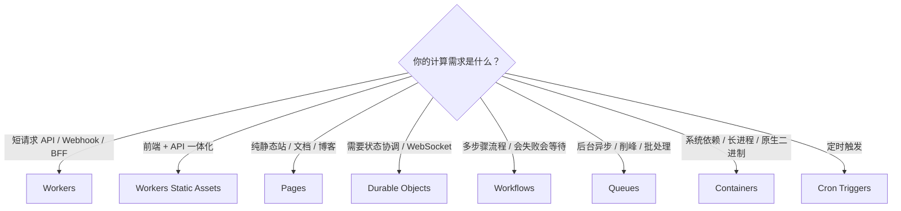
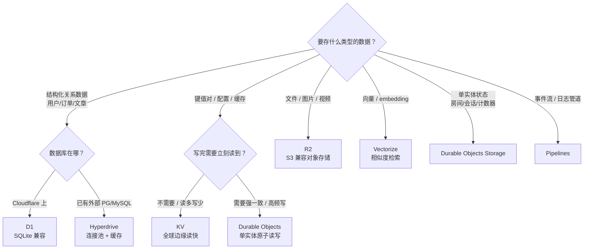
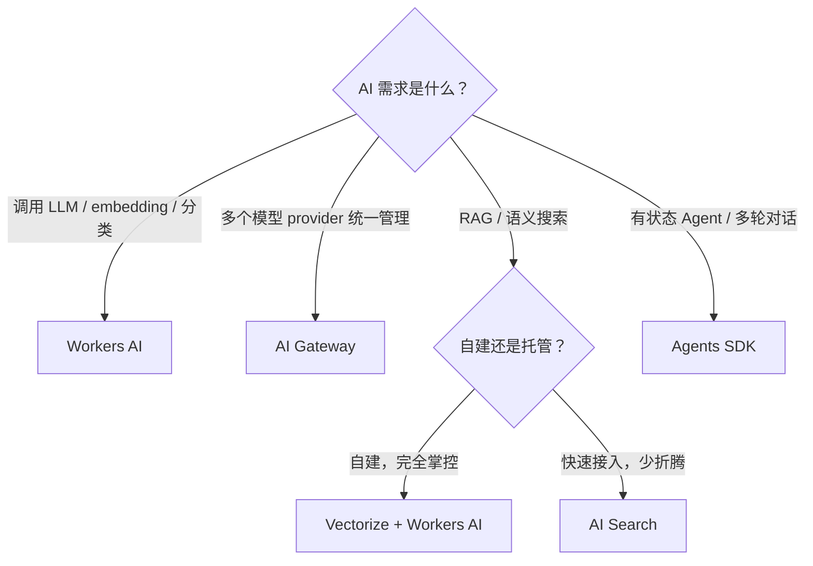
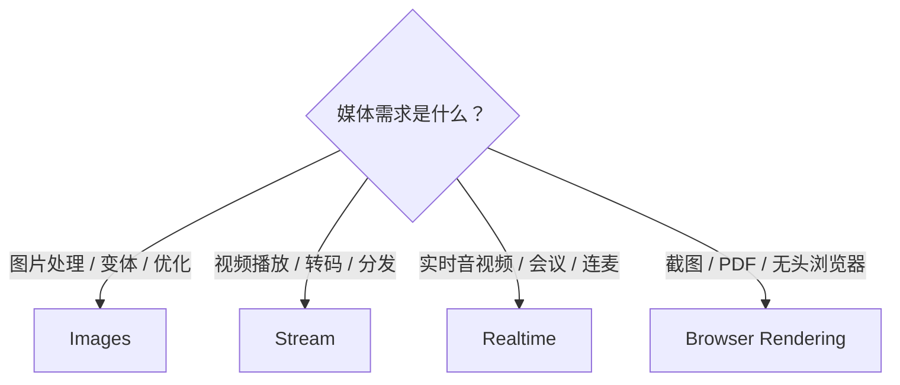
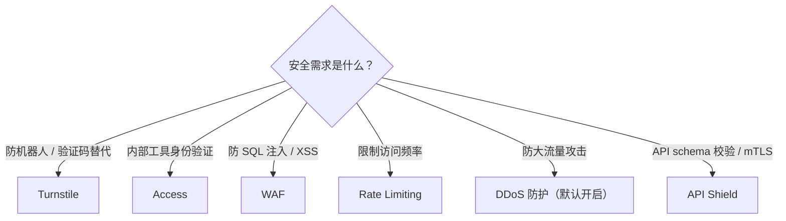
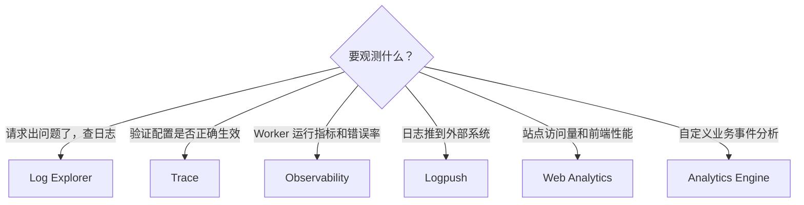

# 2. Cloudflare 功能模块 {#cloudflare-功能模块}

Cloudflare 的能力可以按站点基础、计算、数据存储、AI、媒体、安全、观测七类理解。每个模块说清楚什么时候你会用到、坑在哪。

## <Compass class="cat-icon" /> 站点基础 {#站点基础}

### <Globe class="svc-icon" /> DNS {#dns}
权威 DNS 服务，负责把域名指向网站、API、邮箱等资源。

你买了域名之后，通常先把 NS（Name Server）改到 Cloudflare，让 Cloudflare 接管这个域名的解析。之后 A、AAAA、CNAME、MX、TXT 这些记录都在这里配，子域名、邮箱验证、CNAME flattening、DNSSEC 也都属于这一层。做项目时先把 DNS 配置正确，后面的 Pages、Workers、R2 自定义域名才接得上。

### <Lock class="svc-icon" /> SSL/TLS {#ssl-tls}
浏览器到 Cloudflare、Cloudflare 到源站之间的 HTTPS 加密。

HTTPS 那把小锁主要由这里管。接入 Cloudflare 后，边缘证书通常会自动签发和续期；如果你还有自己的源站，就要注意加密模式：`Full (strict)` 要求源站证书有效，`Flexible` 只加密浏览器到 Cloudflare 这一段，容易引出跳转循环和安全误判。普通静态站和 Workers 项目基本不用折腾证书链；有自建源站时才需要认真看这里。

### <Server class="svc-icon" /> Cache / CDN {#cache-cdn}
静态资源、页面和部分响应的全球边缘缓存。

Cloudflare 会在边缘节点缓存适合缓存的内容，让用户从更近的位置拿文件，不必每次回源站。静态资源、图片、构建后的 JS/CSS 最适合走缓存；登录后的个人数据、实时接口、带权限的响应不要乱缓存。需要精细控制时，用 Cache Rules 配路径、Header、TTL 和绕过规则。

### <ListFilter class="svc-icon" /> Rules {#rules}
重定向、缓存、Header、源站、配置覆盖的规则系统。

想把旧域名 301 到新域名、给某些路径加安全 Header、控制缓存策略、改写 URL、把不同路径转到不同源站，优先看 Rules。它适合处理边缘层的请求策略；只有当逻辑需要读写数据库、调用外部 API、按业务状态判断时，才应该写 Worker。

## <Cpu class="cat-icon" /> 计算 {#计算}

### <Code class="svc-icon" /> Workers {#workers}
Cloudflare 的 serverless 运行时，用来跑 JS/TS、Wasm、部分 Python 等后端逻辑。

这是 AI 编程里最常用的计算层。AI 生成的 Hono API、鉴权接口、Webhook、BFF、MCP Server、轻量 AI 编排，基本都可以放到 Workers。它适合短请求和高并发边缘逻辑；图片处理、大文件转码、长时间任务、原生系统依赖不要硬塞进普通 Worker，应该考虑 Workflows、Queues、R2、Containers 或外部服务。

### <Package class="svc-icon" /> Workers Static Assets {#workers-static-assets}
Worker 项目里的静态资源托管，把前端文件和 Worker 代码作为一个整体部署。

AI 生成 Vite、React、Vue、Svelte、静态文档站或带 API 的前端项目时，这个很顺：HTML/CSS/JS/图片作为静态资源托管，`/api` 之类的动态逻辑走 Worker。默认请求命中静态文件时不执行 Worker；找不到静态文件时才交给 Worker 处理。前后端强绑定、想用一套 Worker 配置管理路由和 API 时，用它比拆成两套服务更清楚。

### <FileText class="svc-icon" /> Pages {#pages}
面向前端项目的部署平台，主打 Git 集成、预览部署和静态站发布。

连上 GitHub/GitLab 后，push 就能构建和发布，适合官网、博客、文档站、活动页、原型页面。Pages Functions 也运行在 Workers 能力上；如果你要的是“前端 + API + 多个绑定”一体化项目，现在更推荐看 Workers Static Assets。已有 Pages 项目、依赖预览部署和 Git 工作流时，继续用 Pages 也没问题。

### <Boxes class="svc-icon" /> Durable Objects {#durable-objects}
有状态对象，适合需要强一致协调、会话状态和 WebSocket 的场景。

Workers 本身是无状态的，每次请求可能落到不同地方；但聊天房间、协作画板、在线游戏房间、计数器、Agent 会话，都需要一个“同一时间说了算”的地方。Durable Objects 的每个实例可以代表一个房间、用户、文档或 Agent，带私有持久化存储，也能处理 WebSocket。它不是拿来存所有业务表的通用数据库；它更像“某个实体的状态和协调中心”。

### <GitBranch class="svc-icon" /> Workflows {#workflows}
持久化的多步骤任务，用来跑会失败、会等待、会重试的流程。

AI 生成的业务经常不是一次请求能做完：先调 API，再写库，再发邮件，再等人工确认，最后发布结果。Workflows 把流程拆成 durable steps，自动保留状态、支持 sleep、等待外部事件和失败重试。订单处理、数据管道、用户生命周期邮件、AI 审核流都适合；普通同步 API 不需要它。

### <ArrowLeftRight class="svc-icon" /> Queues {#queues}
异步消息队列，用来保证任务投递、削峰、批处理和重试。

有些事不该让用户等：发邮件、处理上传文件、写审计日志、批量同步数据、触发后台生成。把消息放进 Queues，消费者 Worker 再慢慢处理，可以批量、延迟、重试，也可以接死信队列。需要立刻返回最终结果的接口别用队列；队列适合“我先收下，后台处理”的任务。

### <Container class="svc-icon" /> Containers {#containers}
在 Cloudflare 上跑容器，适合 Workers 跑不了的语言、库和长进程。

如果 AI 生成的项目依赖系统库、长时间进程、传统 HTTP 服务、原生二进制，Workers 运行时可能不合适，这时 Containers 是更自然的选择。它和 Workers 是配套关系：Worker 可以负责边缘入口和路由，容器承接重后端。代价是启动、资源和计费都比普通 Workers 重；轻 API 不要一上来就容器化。

### <Clock class="svc-icon" /> Cron Triggers {#cron-triggers}
按 cron 表达式定时触发 Worker 的计划任务。

每小时同步一次数据、每天清理一次 D1、定时刷新缓存、周期性检查第三方 API，都可以用 Cron Triggers。它只负责“到点触发一次 Worker”；如果触发后要跑很多步骤、等待人工审批、失败后恢复上下文，就把完整流程放到 Workflows。

## <Database class="cat-icon" /> 数据存储 {#数据存储}

### <Table class="svc-icon" /> D1 {#d1}
Cloudflare 托管的 serverless SQL 数据库，语法接近 SQLite。

AI 生成应用时，用户、订单、文章、配置这些结构化数据可以优先放 D1。它和 Workers、Pages 绑定很自然，也能用 Drizzle ORM 或直接 SQL。要注意的是：D1 更适合中小型应用和边缘应用的关系数据，不是 Postgres 的完整替代品。查询要建索引，别让一次 SELECT 扫完整张表；高并发写入、复杂事务、Postgres/MySQL 特性需求明显时，用 Hyperdrive 连外部数据库更稳。

### <Key class="svc-icon" /> KV {#kv}
全球分布式键值存储，适合读多写少、低延迟读取的数据。

配置、短链映射、feature flag、缓存结果、边缘读取的小块 JSON，都适合 KV。它的重点是“全球读快”，不是“写完立刻所有地方一致”。库存、余额、秒杀名额、实时计数这种需要强一致的东西不要放 KV；这类状态要用 D1 或 Durable Objects。

### <HardDrive class="svc-icon" /> R2 {#r2}
S3 兼容对象存储，用来存文件、图片、视频、附件、备份和数据集。

AI 编程里一碰到用户上传、图片托管、导出文件、备份文件，先想到 R2。它兼容 S3 API，很多现成 SDK 和工具能直接接。R2 的重点是对象，不是表；文件元数据、权限、业务关系放 D1，文件本体放 R2。要做图片变换或视频播放，再配 Images、Stream 或 Worker 处理。

### <Zap class="svc-icon" /> Hyperdrive {#hyperdrive}
连接外部 Postgres/MySQL 的边缘连接池和查询加速层。

如果数据库已经在 Supabase、Neon、RDS、自建 Postgres/MySQL，不想迁移，但 Worker 访问数据库又怕连接慢、连接数爆掉，就用 Hyperdrive。它在 Cloudflare 边缘做连接池，也可以缓存查询结果，减少每次跨区域连库的成本。它不是一个新数据库；它是“让 Workers 更好地连你已有数据库”的中间层。

### <Search class="svc-icon" /> Vectorize {#vectorize}
Cloudflare 的向量数据库，用来存 embedding 并做相似度检索。

做 RAG、语义搜索、相似推荐时会用到它：先把文档切块，转成 embedding，存进 Vectorize；用户提问时再查最相近的向量，把相关文本喂给 LLM。Vectorize 存的是向量和元数据，不是原始文件仓库；原文可以放 R2 或 D1。它不是只有 Paid 才能用，Free 和 Paid 都有对应额度，具体看最新 pricing。

### <Layers class="svc-icon" /> DO Storage {#do-storage}
Durable Objects 自带的持久化存储，跟某个对象实例绑定。

每个 Durable Object 都可以有自己的存储，用来保存这个对象的状态，比如房间成员、协作文档快照、Agent 会话、连接状态、计数器。它的价值是“单实体强一致 + 本地状态”，不是拿来替代 D1 做全局报表，也不是拿来存大量文件。

### <LockKeyhole class="svc-icon" /> Secrets Store {#secrets-store}
集中管理密钥和敏感配置。

API Key、Webhook secret、数据库密码、第三方服务 token，不应该写在代码里，也不应该散落在每个项目配置里。Secrets Store 适合把这些敏感值集中管理，再绑定给 Workers 等服务使用。普通项目也可以先用 Worker secrets；团队协作、多个服务共享密钥、需要审计和轮换时，再看 Secrets Store。

### <ArrowLeftRight class="svc-icon" /> Pipelines {#pipelines}
把事件流和日志持续写入目标存储的数据管道。

当你有持续产生的数据，比如应用事件、行为日志、分析事件，需要稳定写到 R2 等地方做后续分析，就看 Pipelines。它更像数据基础设施，不是普通业务数据库。小项目刚上线不一定需要；等到日志、事件、数据湖这些词真的出现时再引入。

## <Brain class="cat-icon" /> AI {#ai}

### <BrainCircuit class="svc-icon" /> Workers AI {#workers-ai}
Cloudflare 的 serverless AI 推理平台。

你可以从 Worker、Pages 或 REST API 调用 Cloudflare 托管的模型，做 LLM、embedding、文本分类、语音转文字、图片理解等任务。它的好处是部署和鉴权简单，和 Workers、Vectorize、AI Gateway 组合顺。要注意模型列表和能力会变化，不要假设所有 OpenAI/Anthropic 的能力这里都有；复杂推理、多模态高级能力或强模型需求，可能还是要接外部模型。

### <Network class="svc-icon" /> AI Gateway {#ai-gateway}
AI API 的统一网关，负责观测、缓存、限流和成本控制。

同时用 OpenAI、Anthropic、Workers AI、Groq、Mistral 这类 provider 时，不要让代码里散落一堆 API 调用，先接 AI Gateway。它统一记录请求、延迟和错误，并处理缓存、限流、重试、fallback 与成本控制，是模型调用的控制台和保险丝。

### <Scan class="svc-icon" /> Vectorize {#vectorize-ai}
向量数据库，见数据存储。

AI 问答系统的检索层。原文放 R2 或 D1，embedding 放 Vectorize，查询时先检索再交给模型回答。

### <Search class="svc-icon" /> AI Search {#ai-search}
Cloudflare 托管的 AI 搜索能力。

如果你想快速给网站、文档、知识库加语义搜索和问答体验，可以看 AI Search。它比自己手动拼 Workers AI + Vectorize + crawler 更省事，但灵活度也更受产品边界影响。想完全掌控切块、索引、召回和回答逻辑，就自己用 Workers AI + Vectorize 搭。

### <Bot class="svc-icon" /> Agents SDK {#agents-sdk}
构建有状态 AI Agent 的框架，底层基于 Durable Objects。

做多轮对话、工具调用、Agent 记忆、实时 WebSocket、定时任务时，用 Agents SDK 比自己手写状态管理舒服。每个 Agent 可以有自己的状态和存储，适合客服助手、个人助理、自动化机器人、协作型 AI 工具。只是简单调一次 LLM，就不需要上 Agents SDK。

## <Image class="cat-icon" /> 媒体 {#媒体}

### <Image class="svc-icon" /> Images {#images}
图片托管、优化、变体和边缘转换服务。

如果项目里有用户头像、商品图、封面图、内容配图，Images 可以负责上传、存储、压缩、裁剪、格式转换和按需生成不同尺寸。R2 更像通用文件桶，适合存原始对象；Images 更像图片交付管线，适合直接面向页面展示。只存少量静态图片时，用静态资源或 R2 就够；图片量大、尺寸多、要自动优化时再看 Images。

### <Video class="svc-icon" /> Stream {#stream}
视频存储、编码、播放和分发服务。

上传视频后，Stream 负责转码、生成自适应码流、托管播放器和全球分发，适合课程、产品演示、UGC 视频、会员内容。它解决的是“让视频稳定播放”，不是简单存一个 mp4 文件。只是给用户下载原始视频，用 R2 更直接；要网页内播放、转码、多清晰度和观看体验，就用 Stream。

### <Radio class="svc-icon" /> Realtime {#realtime}
实时音视频和低延迟通信能力。

这一组对应 Dashboard 里的 Realtime，包括 RealtimeKit、TURN 服务器、无服务器 SFU、MoQ 中继等能力。做多人会议、语音房、直播连麦、实时互动时会碰到它。普通 WebSocket 协作先看 Workers + Durable Objects；涉及音视频链路、NAT 穿透、SFU 转发和低延迟媒体传输时，再进入 Realtime。

### <MonitorPlay class="svc-icon" /> Browser Rendering {#browser-rendering}
在 Workers 里调用无头浏览器进行渲染、截图和自动化。

需要把网页转成截图、生成 PDF、跑页面渲染检查、抓取自己可访问页面的最终 DOM 时，可以用 Browser Rendering。它适合“需要真实浏览器环境”的任务，不适合普通 HTML 拼接，也不应该拿来绕过登录、付费墙或网站限制。能用服务端模板直接生成的内容，不必上浏览器渲染。

## <Shield class="cat-icon" /> 安全 {#安全}

### <UserCheck class="svc-icon" /> Turnstile {#turnstile}
Cloudflare 的验证码替代方案，用来判断请求是不是来自真实用户。

登录、注册、评论、表单、试用申请都能接 Turnstile。它尽量在后台判断风险，必要时才让用户交互。接入时前端放 widget，后端校验 token；只在前端放组件但后端不验，等于没接。

### <LockKeyhole class="svc-icon" /> Access {#access}
Zero Trust 里的应用访问控制，给内部工具和后台加身份验证。

你做了一个 admin 后台、内部数据看板、临时运维工具，不想自己写登录系统，就用 Access。它会在请求进源站或 Worker 前先做身份验证和策略判断，可以接 Google、GitHub、SAML、OIDC 等身份源。对 AI 编程 的内部工具来说，这是最省事的“先挡在门口”的方案。

### <ShieldAlert class="svc-icon" /> WAF {#waf}
Web 应用防火墙，在请求到达应用前拦截常见攻击。

WAF 可以用托管规则、自定义规则、速率限制等方式处理 SQL 注入、XSS、恶意扫描、异常路径、已知漏洞利用。AI 生成的代码可能有低级安全问题，WAF 能做一层边缘兜底，但不能替代代码修复：鉴权、权限校验、参数校验还是应用自己要做好。

### <Gauge class="svc-icon" /> Rate Limiting {#rate-limiting}
按路径、IP、Header、请求特征限制访问频率。

登录接口、短信验证码、公开 API、AI 调用入口、上传接口，都应该考虑限流。它能防止恶意刷接口、爬虫吃光额度、单个 IP 打爆 Worker。限流不是业务权限系统；它解决“访问太频繁”，不解决“这个人有没有权限”。

### <Umbrella class="svc-icon" /> DDoS 防护 {#ddos-防护}
Cloudflare 网络层和应用层的 DDoS 防护。

Cloudflare 会在边缘网络自动吸收和缓解大量攻击流量，HTTP 层也有对应的检测和规则。大多数小项目不需要专门配置它；遭遇攻击时，重点确认域名已代理到 Cloudflare、源站 IP 没暴露、缓存和 WAF 策略没有误伤正常用户。

### <Braces class="svc-icon" /> API Shield {#api-shield}
面向 API 的安全能力集合，包括 schema 校验、mTLS、发现和滥用检测。

有正式公开 API、移动端 API、合作方 API 时，可以用 API Shield 做 OpenAPI schema 校验、客户端证书、API 发现和风险分析。不符合 schema 的请求可以在边缘直接拦掉，减少打到 Worker 或源站的异常流量。它偏正式 API 治理，小项目早期不一定要上；接口稳定、调用方变多之后价值更明显。

## <Gauge class="cat-icon" /> 观测 {#观测}

### <Search class="svc-icon" /> Log Explorer {#log-explorer}
Cloudflare Dashboard 里的日志搜索工具。

线上请求出问题时，先看这里。Log Explorer 可以按时间、路径、状态码、Ray ID、服务类型等条件搜索日志，用来判断错误发生在 Cloudflare 边缘、Worker 代码、缓存规则、WAF，还是源站。它适合临时排查；长期留存和外部分析交给 Logpush。

### <GitBranch class="svc-icon" /> Trace {#trace}
模拟请求经过 Cloudflare 配置后的处理路径。

你想知道一个 URL 会命中哪些规则、是否走缓存、是否触发 Worker、是否被安全规则影响，就用 Trace。它适合验证配置为什么这样生效，不是完整的应用 APM。遇到“为什么这个路径没有按预期跳转/缓存/转发”时，Trace 比肉眼翻规则更靠谱。

### <ArrowLeftRight class="svc-icon" /> Logpush {#logpush}
把 Cloudflare 日志持续推送到外部目的地。

需要长期留存日志、接入 SIEM、放到 R2/S3/BigQuery/Splunk 等系统分析时，用 Logpush。它解决的是“日志要出 Cloudflare，进入我的数据系统”。小项目不用一开始就配；等你真的需要合规审计、长期趋势、跨系统排查时再上。

### <Gauge class="svc-icon" /> Web Analytics {#web-analytics}
隐私友好的站点访问和前端性能分析。

看页面访问量、来源、国家地区、设备、Web Vitals 和前端性能时用它。它不依赖传统第三方广告追踪模型，也可以通过 JS snippet 接到非 Cloudflare 代理的网站。官网、文档站、博客、产品页都适合先接这个，复杂增长分析再考虑专门分析工具。

### <ClipboardList class="svc-icon" /> Observability {#observability}
Workers 和 Pages 的运行观测入口。

API 上线后，要看请求量、错误率、延迟、异常日志、部署版本表现，就来这里。Workers Logs、Invocation Logs、metrics、traces 都属于这条线。它回答“代码运行得怎么样”；Log Explorer 更偏“请求和边缘层发生了什么”。

### <Table class="svc-icon" /> Analytics Engine {#analytics-engine}
Workers 里的自定义指标和事件分析引擎。

如果你想在 Worker 里写入业务事件，比如按钮点击、接口耗时、模型调用成本、用户行为，再用 SQL 聚合分析，就看 Analytics Engine。它适合高基数事件分析，不适合当事务数据库，也不适合存需要逐条强一致查询的业务记录。

---
